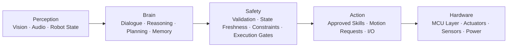

<p align="center">
  
</p>

<h1 align="center">MAMULA Humanoid Robotics</h1>

<p align="center">
  <strong>Humanoid Robotics · Embodied AI · Safety · Native Software · Energy</strong>
</p>

<p align="center">
  <a href="https://mamula.ai">Website</a> ·
  <a href="https://github.com/mamulahumanoid">GitHub</a> ·
  <a href="https://www.youtube.com/@mamulahumanoid">YouTube</a> ·
  <a href="https://www.instagram.com/mamulahumanoid/">Instagram</a>
</p>

---

## Overview

MAMULA is a Türkiye-based R&D project developing a general-purpose humanoid robotics platform for safe, adaptive and multilingual real-world interaction.

MAMULA approaches the humanoid robot as **one integrated system** rather than a collection of disconnected components.

The platform brings together:

- Humanoid hardware
- Embodied AI
- Native robotics software
- Safety architecture
- Perception and state awareness
- Energy and power systems
- Multilingual human-robot interaction

This repository provides a **public technical overview** of MAMULA.

It intentionally contains only information suitable for public release and does **not** expose private source code, model weights, datasets, credentials, proprietary firmware or sensitive implementation details.

---

## System Architecture

MAMULA separates high-level intelligence from low-level control.



### Perception

Processes information from the robot and its environment.

Examples include:

- Vision
- Audio
- Robot state
- Sensor information
- Environmental context

### Brain

Handles high-level intelligence and interaction.

Target capabilities include:

- Dialogue
- Reasoning
- Planning
- Memory
- Robot-state-aware decision making
- Tool and skill selection
- Multilingual interaction

### Safety

Safety is positioned between high-level intelligence and execution.

Requested actions may be checked through mechanisms such as:

- Schema validation
- Allowlisted actions
- State freshness checks
- Safety constraints
- Execution gates

### Action

Approved requests are translated into controlled skills and system actions.

Examples include:

- Skills
- Motion requests
- I/O
- Approved system operations

### Hardware

The execution layer connects approved actions to physical systems.

Examples include:

- MCU layer
- Actuators
- Sensors
- Power systems

---

## AI Proposes. Safety Decides.

High-level AI does **not** directly command joints, motors, torque or low-level control loops.

Actions must pass through validation, current-state checks and safety gates before they can reach the execution layer.

> **AI proposes. Safety decides.**

This separation is a core architectural principle of MAMULA.

---

## Native Robotics Infrastructure

MAMULA runs on its own native robotics infrastructure **without requiring ROS 2**.

The platform is designed around its own runtime components for:

- Events
- Robot state
- Skills
- Actions
- Safety
- AI integration
- Native control
- MCU communication

> **Native robotics infrastructure. No ROS 2 required.**

This is a design choice specific to MAMULA's architecture and is not intended as a general comparison with or criticism of ROS 2.

---

## Embodied AI

MAMULA's intelligence layer is designed for **embodied interaction**, where AI reasons about and acts through a physical robotic system.

Target capabilities include:

- Turkish and English dialogue
- Multilingual interaction
- Planning and reasoning
- Memory-assisted interaction
- Robot-state-aware decision making
- Safe tool and skill invocation
- Interpretation between people
- Perception-aware real-world interaction
- Task planning for embodied environments

The AI layer is designed to work **with** the robot's state and safety systems rather than independently from them.

---

## Safety Philosophy

Safety is treated as part of the system architecture, not as an afterthought.

The high-level intelligence layer is separated from direct low-level actuation.

Before execution, requests may pass through:

```text
Request
   ↓
Validation
   ↓
State Check
   ↓
Safety Gate
   ↓
Approved Action
   ↓
Execution
```

The goal is to ensure that intelligent behavior remains constrained by current robot state, defined permissions and safety requirements.

---

## Energy Systems

Energy is treated as a first-class part of the humanoid platform.

MAMULA's energy architecture includes work around:

- Battery systems
- Charging architecture
- Power distribution
- Monitoring
- Protection
- Power electronics

Mechanical systems, intelligence, software and energy are intended to be developed as parts of the same integrated platform.

---

## Multilingual Human-Robot Interaction

MAMULA is being designed for multilingual communication and real-world interaction.

The initial focus includes:

- Turkish
- English

The long-term direction includes broader multilingual capabilities and interpretation between people.

Language interaction is intended to work together with robot state, memory, planning and perception.

---

## Project Status

**Active R&D**

MAMULA is under active development in Türkiye.

Public information will be expanded as hardware, software, AI and system milestones become appropriate for release.

This repository is intended to remain a controlled public overview rather than a mirror of MAMULA's private development environment.

---

## Public Repository Scope

This repository may contain:

- Public architecture summaries
- Safety philosophy
- Public technical diagrams
- Project descriptions
- Selected documentation
- Public roadmap information
- Official links

This repository will not intentionally publish:

- Private HumanoidOS source code
- Internal datasets
- Training logs
- Model weights
- Credentials or API keys
- Security-sensitive implementation details
- Proprietary MCU firmware
- Confidential hardware design files
- Internal operational data

---

## Official Links

- 🌐 Website: [mamula.ai](https://mamula.ai)
- 💻 GitHub: [github.com/mamulahumanoid](https://github.com/mamulahumanoid)
- ▶️ YouTube: [youtube.com/@mamulahumanoid](https://www.youtube.com/@mamulahumanoid)
- 📷 Instagram: [instagram.com/mamulahumanoid](https://www.instagram.com/mamulahumanoid/)
- ✉️ Contact: [contact@mamula.ai](mailto:contact@mamula.ai)

---

## Türkçe Özet

**MAMULA**, Türkiye'de geliştirilen genel amaçlı bir humanoid robotik Ar-Ge projesidir.

MAMULA; humanoid donanımı, fiziksel yapay zekâyı, güvenlik mimarisini, yerel robotik yazılım altyapısını, algılama sistemlerini ve enerji sistemlerini birbirinden kopuk bileşenler olarak değil, **tek bir bütünleşik sistem** olarak ele alır.

Temel mimari yaklaşım:

```text
Algılama → Beyin → Güvenlik → Eylem → Donanım
```

MAMULA'nın üst düzey yapay zekâ katmanı eklemleri, motorları veya düşük seviyeli kontrol döngülerini doğrudan yönetmez.

Eylemler yürütülmeden önce doğrulama, güncel durum kontrolleri ve güvenlik kapılarından geçebilir.

> **Yapay zekâ önerir. Güvenlik karar verir.**

MAMULA, **ROS 2'ye ihtiyaç duymadan kendi yerel robotik altyapısı üzerinde çalışır.**

Projenin amacı; gerçek dünya etkileşimi için güvenli, uyarlanabilir, çok dilli ve bütünleşik humanoid teknoloji geliştirmektir.

---

<p align="center">
  <strong>MAMULA — Intelligence that moves.</strong>
</p>

<p align="center">
  Built in Türkiye.
</p>
